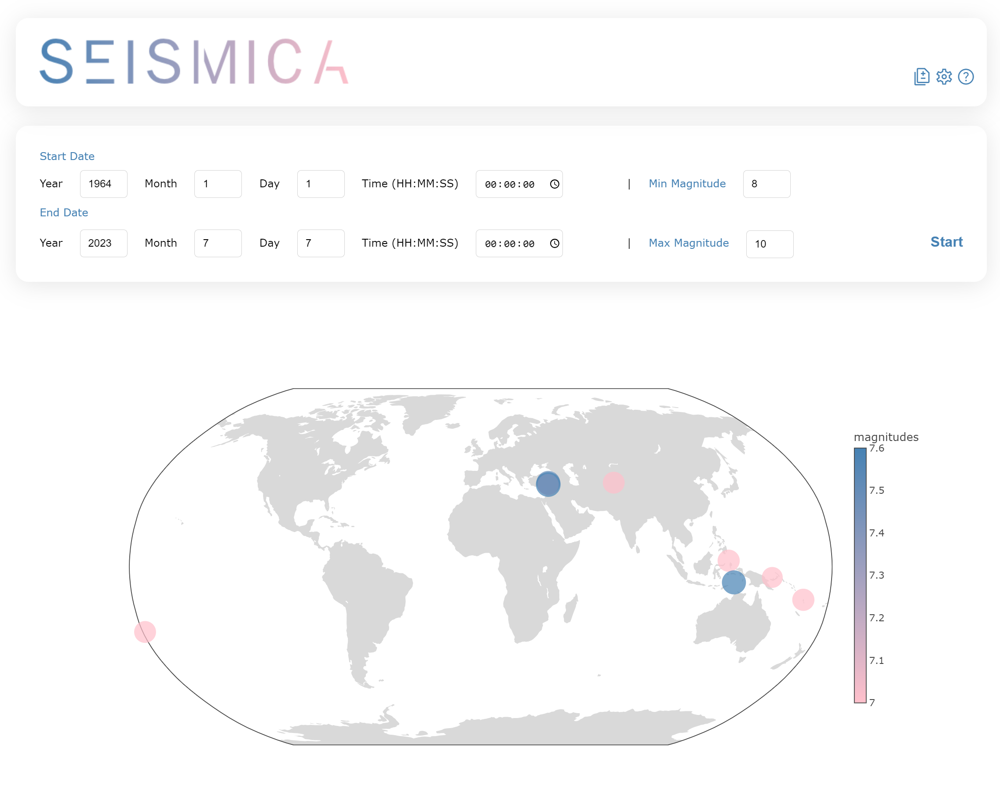

# Seismica: Earthquake Visualization Data App

Welcome to the Seismica repository! This app allows you to visualize earthquakes from a chosen period of time and provides detailed information about each earthquake, including wave data. You can compare multiple earthquakes and view their data and waveforms on a separate page. The app saves data locally and utilizes the Iris web services for earthquake information.



## Table of Contents

- [Getting Started](#getting-started)
- [Tech Stack](#tech-stack)
- [Contributors](#contributors)

## Getting Started

To run the Seismica app locally, please follow the steps below:

### Prerequisites

Before running the app, ensure that you have the following installed on your machine:

- [Node.js](https://nodejs.org) (version 12 or higher)
- [npm](https://www.npmjs.com/get-npm) (normally comes with Node.js installation)
- [Angular CLI](https://angular.io/cli) (to run the Angular client)

### Installation

1. Clone this repository to your local machine or download the source code as a ZIP file.

```
git clone https://github.com/wmaterkowska/EarthquakeApp
```

2. Navigate to the `client` folder:

```
cd seismica/client
```

3. Install the client-side dependencies:

```
npm install
```

4. Navigate to the `server` folder:

```
cd ../server
```

5. Install the server-side dependencies:

```
npm install
```

### Running the App

1. Start the server from server directory:

```
npm start
```

2. Open a new terminal window/tab and navigate to the `client` folder:

```
cd seismica/client
```

3. Run the Angular development server:

```
ng serve
```

4. Open your web browser and visit `http://localhost:4200` to access the Seismica app.

## Tech Stack

The Seismica app is built using the following technologies and frameworks:

- **Express.js:** A fast and minimalist web application framework for Node.js, used for building the server-side of the app.
- **Angular:** A powerful TypeScript-based framework for building dynamic web applications, used for developing the client-side of the app.
- **Iris web services:** An earthquake data service provided by the [Incorporated Research Institutions for Seismology (IRIS)](http://service.iris.edu), which is used to retrieve earthquake information.

## Contributors

This Seismica app is a solo project developed by [Weronika Materkowska](https://github.com/wmaterkowska). If you have any questions, suggestions, or would like to contribute to the project, please feel free to reach out or submit a pull request.

- Your Name: [GitHub](https://github.com/wmaterkowska) | [LinkedIn](https://www.linkedin.com/in/weronika-materkowska-848142231/)